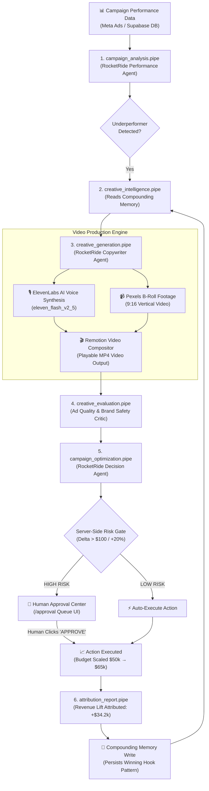

# ⚡ HookLabs × RocketRide — Ad Spend Autopilot
> **RocketRide Buildathon Edition | Problem Statement #10**  
> Evolving creative generation into an autonomous performance marketing optimization system with compounding memory, multi-agent pipeline orchestration, and server-side risk gates.

---

## 🎯 Executive Summary & Problem Statement

Modern performance marketing teams spend millions on paid ad channels (Meta, TikTok, Google) while struggling with two critical bottlenecks:
1. **Manual Creative Fatigue**: Identifying underperforming ad creatives and writing fresh hook variations takes days.
2. **Disconnected Intelligence**: Knowledge gained from past high-performing creatives is lost across campaign resets instead of compounding over time.

**HookLabs × RocketRide Ad Spend Autopilot** solves this by establishing a **closed-loop autonomous creative optimization system**. Powered by 6 specialized RocketRide `.pipe` multi-agent workflows, ElevenLabs TTS voice synthesis, Pexels stock visual retrieval, and Remotion video composition, HookLabs autonomously detects campaign underperformers, reads from compounding memory, generates replacement video ads, evaluates brand safety, and escalates high-risk budget optimizations to human managers.

---

## 🌌 RocketRide Pipeline Orchestration Flowchart



---

## 🚀 Step-by-Step Golden Demo Walkthrough

### Step 1: Campaign Data Ingestion & Pacing Analysis
- **Execution**: `pipelines/campaign_analysis.pipe`
- **Action**: Analyzes daily budget pacing, spend, and ROAS across active campaigns.
- **Input**: `"Summer Sale"` campaign ($50,000 daily budget, Target ROAS: 3.50x, Current ROAS: 4.41x).

### Step 2: Underperforming Creative Identification
- **Execution**: `pipelines/campaign_analysis.pipe`
- **Action**: Identifies fatigued creative assets holding back ROAS.
- **Output**: Identifies `"Static Product Catalog Image"` (0.95x ROAS, high CPC) as an underperformer.

### Step 3: Compounding Creative Memory Retrieval
- **Execution**: `pipelines/creative_intelligence.pipe`
- **Action**: Queries Supabase `creative_memory` table for historical winning creative angles for the DTC founder audience.
- **Retrieved Memory**:
  > *"Stop spending $5k/mo on video editors when AI writes & renders hooks in 30s"*  
  > (**+2.8x CTR Lift**, **94% Confidence**)

### Step 4: Multi-Variant Creative Generation & Asset Production
- **Execution**: `pipelines/creative_generation.pipe`
- **Action**: Generates 3 structured creative concepts derived from the memory pattern.
- **Voiceover Synthesis**: Sends approved script to ElevenLabs TTS API (`eleven_flash_v2_5`).
- **Visual Footage**: Queries Pexels API for 9:16 vertical portrait stock footage.

### Step 5: Remotion Video Composition & Brand Safety Evaluation
- **Execution**: `pipelines/creative_evaluation.pipe` + Remotion Engine
- **Action**: Composes visual footage, voiceover MP3, and kinetic captions into a playable MP4. Evaluates brand safety and ad quality (**Quality Score: 92/100, Brand Safety: PASS**).

### Step 6: Server-Side Risk Gate Evaluation
- **Execution**: `pipelines/campaign_optimization.pipe`
- **Action**: Recommends scaling daily budget from $50,000 to $65,000 (+30% increase, +$15,000 delta).
- **Risk Gate Rule**: Delta > $100 OR > 20% budget change $\rightarrow$ **FLAGGED AS HIGH RISK**.

### Step 7: Human-in-the-Loop Approval Center
- **Execution**: `/approval` Queue UI
- **Action**: High-risk optimization request is safely enqueued. The marketing manager reviews current budget, proposed budget, delta, and AI confidence before clicking **"APPROVE"**.

### Step 8: Closed-Loop Attribution & Compounding Memory Update
- **Execution**: `pipelines/attribution_report.pipe`
- **Action**: Executes campaign action, tracks revenue lift (**+$34,200 attributed revenue lift**), and writes closed-loop verification results back to Supabase `creative_memory` to make future recommendations even smarter.

---

## 🛠️ Technology Stack & Architecture

| Component | Technology | Purpose |
| :--- | :--- | :--- |
| **Framework** | Next.js 14 (App Router, React 18, TypeScript) | Unified web interface and API routing |
| **Database & Auth** | Supabase (PostgreSQL, `@supabase/ssr`, RLS) | Persisted campaign state, approval queue, and creative memory |
| **Agentic Framework** | RocketRide Multi-Agent `.pipe` Engine | Autonomous multi-agent pipeline orchestration |
| **Voiceover Engine** | ElevenLabs API (`eleven_flash_v2_5`) | High-quality text-to-speech voice synthesis |
| **Visual B-Roll** | Pexels Stock Video Search API | High-CTR vertical (9:16) stock video retrieval |
| **Video Compositor** | Remotion Lambda Video Compositor | Automated MP4 video composition and caption rendering |
| **Styling** | Vanilla CSS Tokens & Lucide Icons | Dark cinematic UI styling matching Figma design system |

---

## 📋 RocketRide `.pipe` Registries

1. [`pipelines/campaign_analysis.pipe`](file:///d:/Hooklabs_bvdu/HookLabs_BVDU/pipelines/campaign_analysis.pipe): Performance & pacing agent detecting creative fatigue.
2. [`pipelines/creative_intelligence.pipe`](file:///d:/Hooklabs_bvdu/HookLabs_BVDU/pipelines/creative_intelligence.pipe): Compounding memory reader & writer.
3. [`pipelines/creative_generation.pipe`](file:///d:/Hooklabs_bvdu/HookLabs_BVDU/pipelines/creative_generation.pipe): Multi-variant copywriter generating hooks & scripts.
4. [`pipelines/creative_evaluation.pipe`](file:///d:/Hooklabs_bvdu/HookLabs_BVDU/pipelines/creative_evaluation.pipe): Quality critic & brand safety validator.
5. [`pipelines/campaign_optimization.pipe`](file:///d:/Hooklabs_bvdu/HookLabs_BVDU/pipelines/campaign_optimization.pipe): Decision agent & server-side risk gate.
6. [`pipelines/attribution_report.pipe`](file:///d:/Hooklabs_bvdu/HookLabs_BVDU/pipelines/attribution_report.pipe): Closed-loop multi-touch revenue synthesizer.

---

## ⚙️ Environment Setup (`.env.local`)

```env
# Supabase Configuration
NEXT_PUBLIC_SUPABASE_URL=https://qsvwdksghrjdeorctqzj.supabase.co
NEXT_PUBLIC_SUPABASE_ANON_KEY=your_supabase_anon_key
SUPABASE_SERVICE_ROLE_KEY=your_supabase_service_role_key

# RocketRide Cloud API
ROCKETRIDE_API_KEY=your_rocketride_api_key
ROCKETRIDE_URI=https://api.rocketride.ai

# Voiceover & Media API Keys
ELEVENLABS_API_KEY=your_elevenlabs_api_key
PEXELS_API_KEY=your_pexels_api_key
```

---

## ⚡ Quickstart Commands

```bash
# 1. Install Dependencies
npm install

# 2. Run Local Development Server
npm run dev
# App available at http://localhost:3000

# 3. Execute Golden Demo Loop Verification Test
node ./scripts/test-golden-demo.mjs

# 4. Verify TypeScript Type Safety
npx tsc --noEmit

# 5. Build Production Bundle for Vercel
npm run build
```

---

## 🏆 Hackathon Compliance & Verification

- **TypeScript Compilation**: `npx tsc --noEmit` $\rightarrow$ **0 Errors**
- **Production Build**: `npm run build` $\rightarrow$ **100% Passed (47/47 pages)**
- **Golden Demo Verification**: `node ./scripts/test-golden-demo.mjs` $\rightarrow$ **100% Passed**